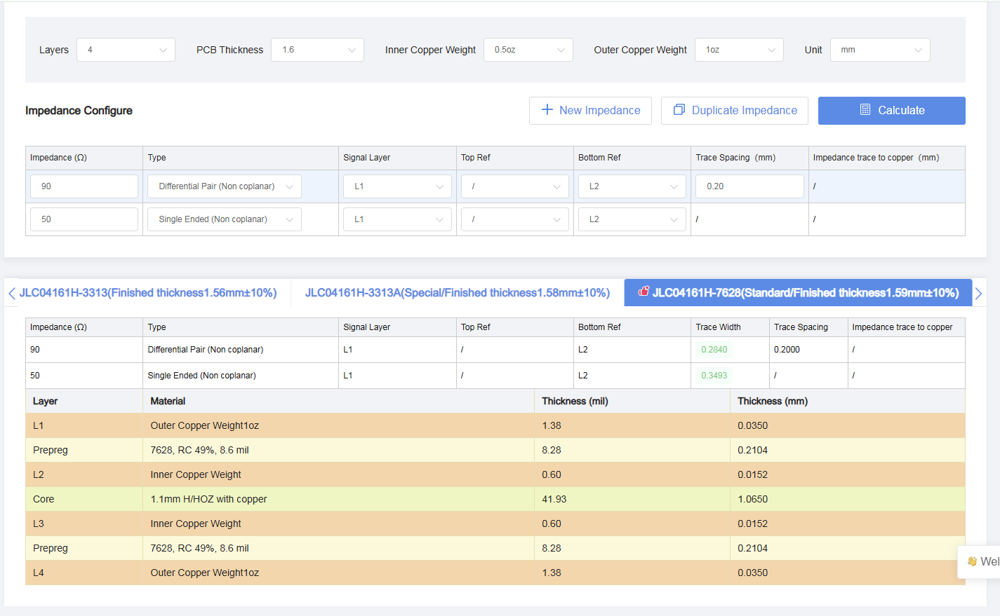

# PCB Design 

## Repository Structure
```
PCB Designs/
├── JLCPCB_Files/
│   ├── Stencil
│   ├── board1_nrf5340
│   ├── board2_stm32
│   ├── Stencil.zip
│   ├── board1_nrf5340.zip
│   └── board2_stm32.zip	
├── cb_v1/
│   ├── STM32U5
│   └── nRF5340	
├── cb_v2/
│   ├── STM32U5
│   └── nRF5340	
├── Parts_list.xlsx
└── pcb ordering JLCPCB.pdf
```
## Requirement

* [KiCAD 8.0](https://www.kicad.org/download/)

## Production House
* [JLCPCB](https://jlcpcb.com/)
>[!NOTE]
> Follow the [PDF](https://github.com/ihsan92UM/Project-work/blob/359b432a75f67255255755fd50f5ba6b127fc0ec/PCB%20Designs/pcb%20ordering%20JLCPCB.pdf) for ordering manual. Both Custom board uses recomended stackup for 1.6mm diameter with Impedence control.




## Folder Deatils
| Folder | Comments     |
|------------------------------|------------------------------|
|  JLCPCB_Files                    | .zip files are Production files for JLCPCB           |
| cb_v1                 | Sensor Measurement Board (60mm Diameter )          |
| cb_v2          |   Final Custom Board files |
| Parts_list.xlsx                | Remaining components           |


  

