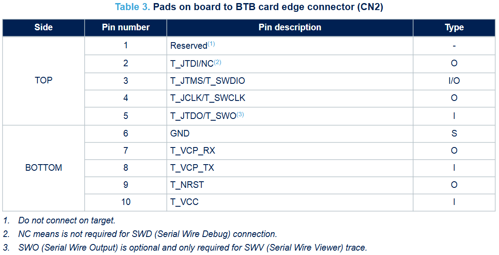

# Programming Guide - STM32U545RET6Q Custom Board 

## Requirements

#### Hardware

* [STLINK-V3MINIE](https://www.st.com/resource/en/user_manual/um2910-stlinkv3minie-debuggerprogrammer-tiny-probe-for-stm32-microcontrollers-stmicroelectronics.pdf)
* Type C Cable
* [STM32U545RET6Q cb_v1 or cb_v2](https://www.st.com/en/microcontrollers-microprocessors/stm32u545re.html)
* [Tag Connect TC2030-IDC-NL](https://www.tag-connect.com/product/tc2030-idc-nl)

> [!WARNING]  
> Without an official ST-LINK, device can be programmed but the debugger option doesn't work, it is also unreliable. ST Microelectronics doesn't support clone ST-LINKs anymore.

#### Software
* [STM32CubeIDE 1.17.0](https://www.st.com/en/development-tools/stm32cubeide.html)
* [STM3CubeProgrammer](https://www.st.com/en/development-tools/stm32cubeprog.html)

# Getting Started
To program the custom board based on STM32U545RET6Q , STLINK-V3MINIE is used. STLINK-V3MINIE contains a ST-LINK SWD Programmer. This required following setup.

***Connection type*** : PADS ON BOARD

| Custom Board | STLINK-V3MINIE | Comments |
|--------------|-----------------|----------|
| SWDCLK      | T_JCLK/T_SWCLK         |  PIN 4 , Top Side        |
| SWDIO       | T_JTMS/T_SWDIO           |  PIN 3 , Top Side       |
| SWO    | T_JTDO/T_SWO            | PIN 5 , Top Side          |
| GND          | GND             |    PIN 6 , Bottom Side       |
| VDD      | T_VCC           |   PIN 10 , Bottom Side       |
| RESET        | T_NRST           | PIN 9 , Bottom Side |

*Connect An external 3.3v and GND to Custom Board. Make sure to have common GND with STLINK-V3MINIE*

| Custom Board | External Supply , nPM1300EK | Comments |
|--------------|-----------------|----------|
| GND          | GND             |           |
| VDD      | VDD           |     3.0V to 3.3V  |
> [!TIP]
> nPM1300EK can be used to supply power, just setup VOUT2 of the EK with 3.3V using  nPM Power Up software inside nRF Connect Desktop application.

> [!IMPORTANT]  
> STLINK-V3MINIE Doesn't provide any power to the custom board rather it detects VDD level. That is why it is written as Target VDD or T_VDD etc. Follow the below picture for further reference. 

***Connection type*** : JTAG Connector
> [!TIP] 
> Use a STDC14 Adapter to pinout the SWD pins

# Setup Validation

## STM32CubeProgrammer

Open the `STM32CubeProgrammer` application and select `STLINK` as Interface and `Connect`. Once connected on the `Target Information` window it will list the MCU that is connected. On the `ST-LINK configuration` window it will show the target voltage level.

## Porgramming

Device can be now programmed as usual as a Nucleo board.

