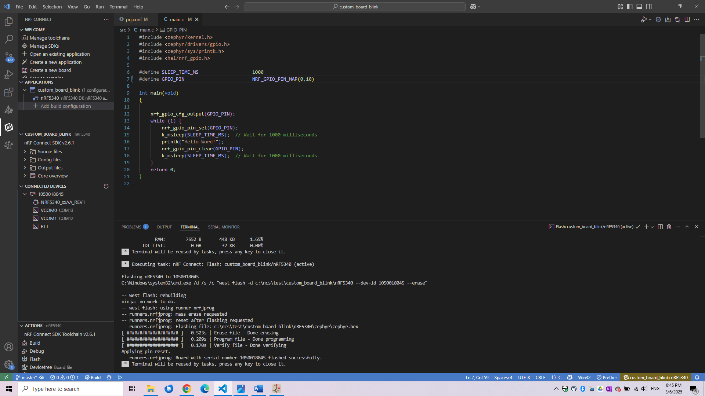

# Programming Guide - nRF5340 Custom Board 

## Requirements

#### Hardware

* [nRF5340 DK](https://www.nordicsemi.com/Products/Development-hardware/nRF5340-DK)
* Micro USB 2.0 Cable
* [nRF5340 cb_v1 or cb_v2](https://content.u-blox.com/sites/default/files/NORA-B1_DataSheet_UBX-20027119.pdf)
* [Tag Connect TC2030-IDC-NL](https://www.tag-connect.com/product/tc2030-idc-nl)

#### Software
* [VS Code](https://code.visualstudio.com/)


# Getting Started
To program the custom board based on nRF5340 , nRF5340DK is used. nRF5340DK contains a Segger JLINK to program other compatabile devices. This required following setup of the nRF5340DK.

**Connector:** P20 


| Custom Board | DK (Programmer) | Comments |
|--------------|-----------------|----------|
| SWDCLK      | SWDCLK          |          |
| SWDIO       | SWDIO           |          |
| GND          | GND             |          |
| VTG          | VDD_nRF             | If using P20 |
| SWO    | SWO             | If using P20 |
| VDD      | VDD_nRF            | If powering the external board from the DK |
| RESET        | RESET           | Optional |

> [!WARNING]  
>  Ground (GND) and voltage level (VDD) must be the same on the DK (used as programmer) and the target board (with the SoC to be programmed) for the external board to be detected and for programming to work.


> [!TIP] 
> Shorting VTG and VDD will disable the DKs onboard nRF5340 Chip. Later, this shorted pin has to be connected to the Custom Boards VDD. If a Custom Board is connected, in the VS Code it will show the Custom Board and can be programmed as usual afterwards.


# Setup Validation

## Without Custom Board

Only VTG and VDD_nRF are shorted but not connected to the Custom Board. Inside the `Connected Devices` tab `NRF5340_xxAA_REV1` chip will not `appear` or `detected`. 


## With Custom Board

VTG and VDD_nRF is shorted and connected to the Custom Board. `NRF5340_xxAA_REV1` Chip will appear.




# Programming

Follow the documentation for nRF5340DK programming. 
> [!IMPORTANT] 
> It is important to edit `prj.conf` file and add these files extra as below to run codes inside the custom board. Only difference between Custom Board and the DK is Custom Board lacks `external Low frequency Oscillator`. And the code running on nRF5340DK expects this.
```
# Reboot
CONFIG_REBOOT=n
CONFIG_RESET_ON_FATAL_ERROR=n


# clock config  custom board
CONFIG_CLOCK_CONTROL_NRF_K32SRC_RC=y
CONFIG_CLOCK_CONTROL_NRF_K32SRC_XTAL=n


# custom board logger config
CONFIG_LOG=y
CONFIG_CONSOLE=y
CONFIG_RTT_CONSOLE=y
CONFIG_USE_SEGGER_RTT=y
CONFIG_UART_CONSOLE=n

```

