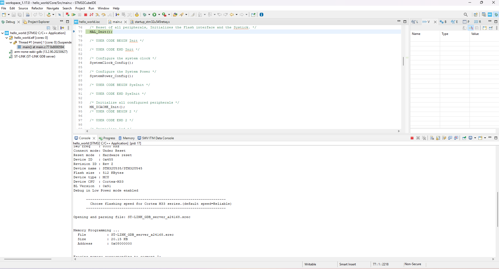

# Programming Guide - Nucleo-U545RE-Q

## Requirements

#### Hardware
* [Nucleo-U545RE-Q](https://www.st.com/en/evaluation-tools/nucleo-u545re-q.html)
*  Type C cable 
#### Software
* [STM32CubeIDE1.17.0](https://www.st.com/en/development-tools/stm32cubeide.html)
* [STM32CubeMX](https://www.st.com/en/development-tools/stm32cubemx.html)
* [STM32CubeProgrammer](https://www.st.com/en/development-tools/stm32cubeprog.html)


#### Software Basics

- **STM32CubeIDE 1.17.0**: An integrated development environment (IDE) used to write, compile, debug, and run code on STM32 microcontrollers.  
- **STM32CubeMX**: A graphical configuration tool for setting up pins, peripherals, and middleware, which generates initialization code for use in STM32CubeIDE.

These two complement each other, STM32CubeMX is opened initially inside the STM32CubeIDE to setup target and .ioc file.

# Getting Started
Download all three required software and open `STM32CubeIDE1.17.0`


> [!WARNING]  
>  Existing STM32 codes are written using STM32CubeIDE version 1.17.0. Higher version can be installed, and codes has to be migrated.


# Creating a sample programme


Select a directory where codes can be saved inside the popup ```Select a Directory as a workspace``` and save it with a proper name.

Click on `file` then `new` then `stm32 project` and it will open a select `target window` as below.


After this select `Next` and give the program a name.


Click `finish`.

It will open a board specific software selection , just click `OK` , if all needed, else `Untick`. Now it will open a `.ioc` file, where we can setup the peripherals for the program. This is highly specific for the individual Program.


The `.ioc` file/Window contains multiple tabs.

* Pinout and Configuration 


* Clock Configuration


* Project Manager 


* Tools

Inside the `Pinout and Configuration` , peripherals are set. Inside `Clock Configuration`, clock is configured and finally inside `project manager`, stack or heap size and function visibilty from static can be changed.

### Coding

In the ```Explorer``` tab, newly opened application will contain these files. These files are minimum for an STM32CubeIDE application. 

```
Project Explorer
└── hello_world
    ├── Includes
    ├── Core
    ├── Drivers
    │   ├── CMSIS
    │   └── STM32U5xx_HAL_Driver
	├── .  hello_world.ioc
	├── .  
	└── .

```
Edit the `main.c` file by accessing `Core/Src/main.c` to write program.

### Flashing into the board

Click on the Project Head from the explorer tab :


Then select `Debug As` then `STM32 Application` , it will open this window :


Click `SWD` interface , tick `STLINK S/N` and `Scan` for the Nucleo board then Click `Apply` and `OK`.

It will now `generate code` or `build` the code accordingly before flashing onto the board. Once it is done flashing `debug perspective` will open as below :



Navigate the Debug window of the Programme from `HAL_Init();` using the debug commands from the Top of the window :


