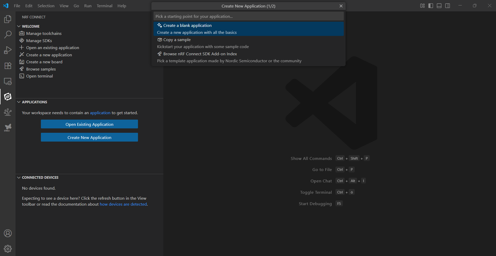
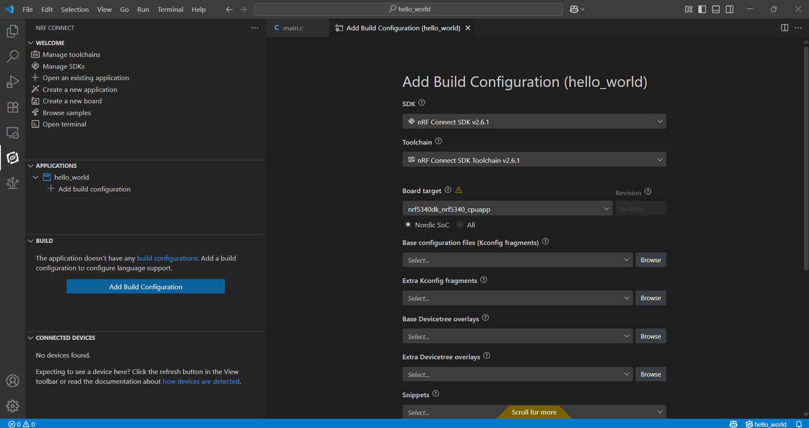
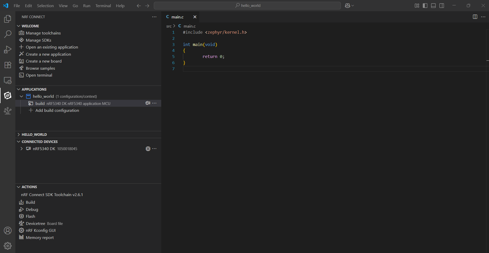
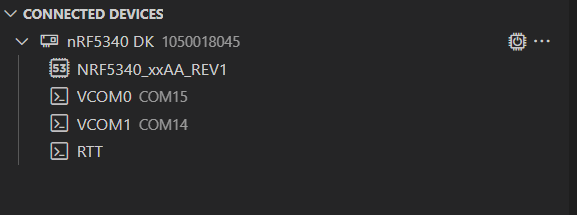
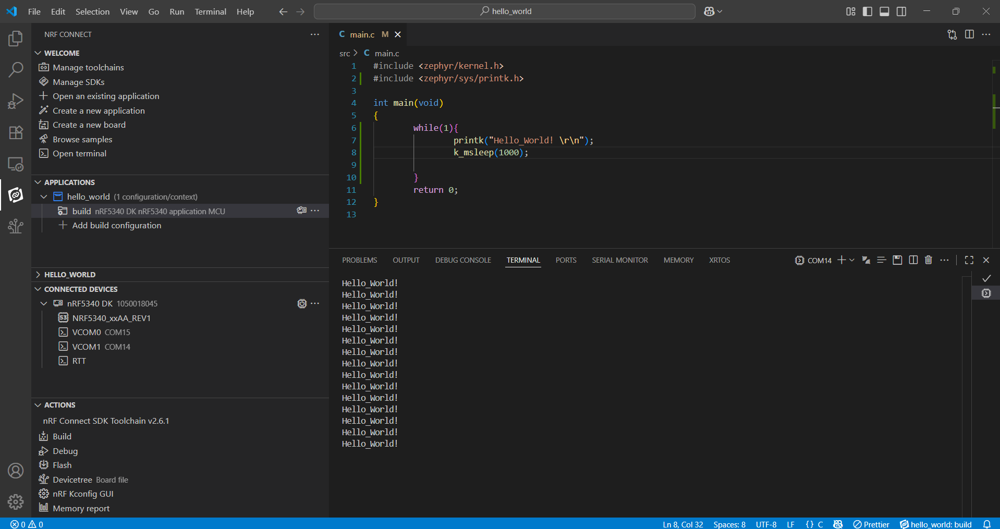

# Programming Guide - nRF5340DK

## Requirements

#### Hardware
* [nRF5340 DK](https://www.nordicsemi.com/Products/Development-hardware/nRF5340-DK)
* Micro USB 2.0 Cable
#### Software
* [VS Code](https://code.visualstudio.com/)


# Getting Started
Follow this [Guide](https://academy.nordicsemi.com/courses/nrf-connect-sdk-fundamentals/lessons/lesson-1-nrf-connect-sdk-introduction/topic/exercise-1-1/) to install nRF Connect SDK 2.6.1 and nRF Connect for VS Code. Please note the required version of the SDK and ToolChain.

* SDK : ncs 2.6.1 
* Toolchain : 2.6.1 , can be updated version

> [!WARNING]  
>  Latest ncs version can be installed but there could be code compability issue, i.e., BLE stack

# Creating a sample programme
goto the nRF Connect and create a new application by selecting ```Create New Application``` menu. it will pop-up a small window with 3 options,

* Create a blank application
* Copy a sample
* Browse nRF Connect SDK Add-on Index

Select ```Create a blank application``` and save it with a proper name.




In the ```Explorer``` tab, newly opened application will contain these files. These files are minimum for an nRF connect SDK application. 

>[!NOTE]  
> nRF Connect SDK is based on Zephyr, if your systems already has an Zephyr installation, They might interefere with each other.

```
Hello_World/
├── src/
│   └── main.c
├── CMakeLists.txt
├── prj.conf
├── VERSION
└── .gitignore

```

Now goto nRF Connect tab and in Build option select ``` Add Build Configuration``` , now in the ``` Add Build Configuration``` window select options as below:

* SDK : nRF Connect SDK v2.6.1
* Toolchain : nRF Connect SDK Toolchain v2.6.1
* Board Target: nrf5340dk_nrf5340_cpuapp

Scroll down select ```optimization level``` accordingly. e.g., for debugging mode ```Build Directory``` 
can be renamed. Can be nRF5340DK if DK is used, if Custom Board, a different name can be used to differentiate two build configurations.




Once build is complete an ```ACTIONS``` tab will appear.



Press ```Build``` and ```Flash``` to flash the programme into nRF5340DK, the nRF5340DK will show inside the ```CONNECTED DEVICES``` Tab.




Use the built-in VCOM ports to see the programme output.

# Sample Hello_World Printing

Add the ```printk``` module by adding ```#include <zephyr/sys/printk.h>``` to enable print funtion. 
Then call ```printk("Hello_World! \r\n");``` every 1000ms

```
#include <zephyr/kernel.h>
#include <zephyr/sys/printk.h>

int main(void)
{
        while(1){
                printk("Hello_World! \r\n");
                k_msleep(1000);

        }
        return 0;
}
```

Press ```Build``` and ```Flash``` to flash the programme into nRF5340DK, the nRF5340DK will show inside the ```CONNECTED DEVICES``` Tab. Then select ```VCOM1``` to view the output.




